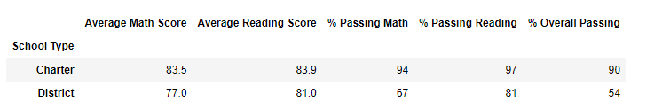

# School_District_Analysis
## Project Overview
  

   The school board has notified that the "students_complete.csv" file shows evidence of academic dishonesty on "reading" and "math" grades for Thomas High School ninth graders  which appears to have been altered.
  
  Also, the school board does not know the full extent of the academic dishonesty, so they want to hold on state-testing standards and need help to solve this problem.
    Their requirement is to make Thomas High School with NaNs, so that rest of the data will remain intact.

## Purpose 
  

  The purpose of this project is to analyze the School District data on basis of school budget, student scores as per their grades.
  Also, to learn new insights which will give us clear view of results on each school's performance. 
  

 ## Requirements:
  - A high-level snapshot of the district's key metrics, presented in a table format
  - An overview of the key metrics for each school, presented in a table format
  - Tables presenting each of the following metrics
  - Top 5 and bottom 5 performing schools, based on the overall passing rate
  - The average math score received by students in each grade level at each school
  - The average reading score received by students in each grade level at each school
  - School performance based on the budget per student
  - School performance based on the school size 
  - School performance based on the type of school
  

  
  ## Resources
  - Jupyter Notebook
  - Python 3.7.6
  - Dependencies
      - Python Pandas library
      - Python Numpy library

## Results:

- How is the district summary affected?
	
	It has changes to all scores by less than 0.5 percentage points (or change by less than 0.5%) - no impact to school or student count.
  
  

	

- How is the school summary affected?

    No change to ranking, however Thomas High School scores did change, but by less than 1 percentage point (or changed by less than 1%) for each metric.
	
	
  

	

- Top 5 performing schools:

	

	
	
	
- Bottom 5 performing schools:

	

	
	
	
- How does replacing the ninth graders’ math and reading scores affect Thomas High School’s performance relative to the other schools?
     - The overall passing percentage for Thomas High School fell to 65%
     - The overall passing percentage for the entire district fell to 64.9%
     - Thomas High School was no longer included on the list of top five schools.

- How does replacing the ninth-grade scores affect the following:
	- The overall passing percentages of Thomas High School decreased by 0.11%
	- The average scores of Thomas High School for math and reading increased by 0.06
	- For the spending range of $630-644 per student, the overall passing percentage decreased by 0.1%
	- School rankings are unchanged. Thomas High School is still the second-best performing school in the district with an overall passing rate of 90.63% among their tenth 	  through twelfth graders.
   
- **Math scores by grade**
    	
	

 
	
	
	
 -  **Reading scores by grade**	
  	
 

	
  	
 - **Scores by school spending** 
        
	*Score by school spending Original:*
	

    	

	
	*Score by school spending Updated:*
	
	
	
	
  - **Scores by school size:**
   	 
	

	
	
	*Scores by School Size - changes to Medium (1000-2000) grouping for all scores by less than 0.1 percentage points (or change by less than 0.1%).*
	
	
  - **Scores by school type:**
  	 
	

	
	
	*Scores by School Type - changes to Charter type grouping for all scores by less than 0.1 percentage points (or change by less than 0.1%).*
  

## Summary: 

	
After replacing reading and math scores to Nan for the ninth grade at Thomas High School, some changes occur in School district analysis:
  
- Relacing by the ninth graders' scores with NaN, Thomas High School's overall passing percentages and average scores changes abruptly. 
  
- The district has also had its average math and reading scores decrease, as well as the overall passing percentage for students. 
	
- Also, Thomas High School lost its ranking as a top five school within this District. 
	
- But after updating the total student counts and exclude it to the Thomas High School ninth graders and removing their scores from the school data,
  Thomas High School again achieve its high average scores and gain its position as the number two school in the District.
	

